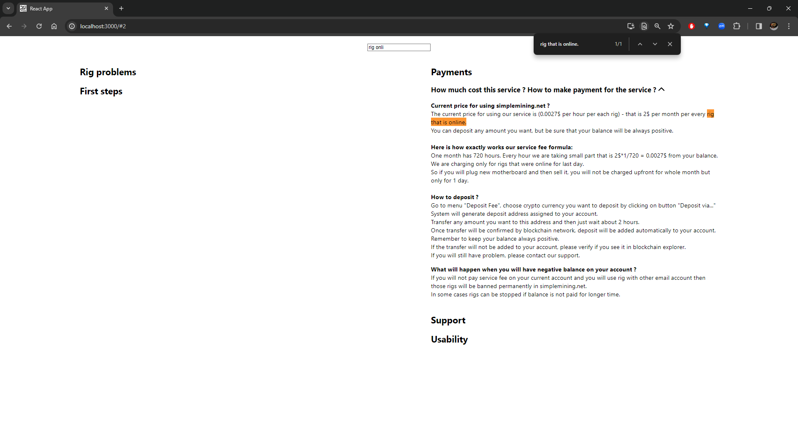

# wyszukiwarka-typescript
strona FAQ z wyszukiwarką na podstawie danych z pliku json

## Opis
Twoim zadaniem jest stworzenie strony FAQ z wyszukiwarką na podstawie danych z pliku 02-faq.json

FAQ jest podzielony na grupy tematyczne w których są pytania i odpowiedzi. 

Sama grupa tematyczna ma jeszcze określoną kolumne (left|right) w jakiej się znajduje. 

Wyszukiwarka ma szukać po pytaniach i treści odpowiedzi fulltextowo, czyli wpisując "rig onli" powinno wyświetlić pytania gdzie występuje fraza "rig that is online."

Na początku powinny się pojawiać wszystkie grupy i pytania, po wpisaniu w wyszukiwarkę pytania powinny się zawężać do aktualnie filtrowanych.

Kliknięcie w pytanie rozwija/zwija odpowiedź. (dodatkowo można dodać hash w adresie zeby po odswiezeniu strony pytanie juz bylo rozwinięte)

Tagi htmlowe zawarte w odpowiedziach nie mają być escapowane, np. tag `<table>` ma wyświetlić tabelkę.

## W rozwiązaniu użyj:
* React
* Sass
* Funkcji map, filter itp. (ES6+)
* Github pages, heroku lub innego miejsca, żeby można było zobaczyć rozwiązanie online

## Mile widziane użycie:
* Typescript